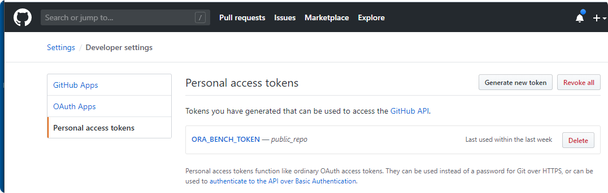

# dcr_dev: Document Content Recognition Development Image

This image supports the use of a Docker container for the further development of the dcr project in an Ubuntu environment.

### Table of Contents

**[1. Installed core components](#installed)**<br>
**[2. Creating a new dcr development container](#creating)**<br>
**[3. Working with an existing dcr development container](#working)**<br>
**[4. Best practices](#best)**<br>

----

## <a name="installed"></a> 1. Installed core components

With the following command you can check in detail which software versions are included in the Docker image:

    apt list --installed

---

### Version 0.9.0

| Component         | Version                | Remark                           | Status  |
|-------------------|------------------------|----------------------------------|---------|
| asdf              | v0.9.0-7493f40         | base version                     |         | 
| curl              | 7.68.0                 | base version                     |         | 
| DBeaver           | 22.0.2                 | for virtual machine only         | upgrade | 
| Docker Desktop    | 20.10.14               | base version [Docker Image & VM] | upgrade | 
| dos2unix          | 7.4.0                  | base version                     |         | 
| GCC & G++         | 9.4.0                  | base version                     |         |
| Git               | 2.25.1                 | base version                     |         | 
| GNU Autoconf      | 2.69                   | base version                     |         | 
| GNU Automake      | 1.16.1                 | base version                     |         | 
| GNU make          | 4.2.1                  | base version                     |         | 
| htop              | 3.1.2                  |                                  |         | 
| OpenSSL           | 1.1.1f                 | base version                     |         | 
| Pandoc            | 2.18                   |                                  | upgrade | 
| PDFlib TET        | 5.3                    |                                  |         | 
| Poppler           | 0.86.1                 | base version                     |         | 
| procps-ng         | 3.3.16                 | base version                     |         | 
| Python3           | 3.10.4                 |                                  | upgrade |
| Python3 - pip     | 22.0.4                 | base version                     |         |
| Tesseract OCR     | 5.1.0                  | base version                     |
| TeX Live          | 2019                   | base version                     |         | 
| TeX Live - pdfTeX | 3.14159265-2.6-1.40.20 | base version                     |         | 
| tmux              | 3.2a                   |                                  |         | 
| Ubuntu            | 20.04.4 LTS            | base version [focal]             |         | 
| Vim               | 8.1.2269               | base version                     |         |
| wget              | 1.20.3                 | base version                     |         | 

---

### Version 0.8.0

| Component         | Version                | Remark                           | Status  |
|-------------------|------------------------|----------------------------------|---------|
| asdf              | v0.9.0-7493f40         | base version                     |         | 
| curl              | 7.68.0                 | base version                     |         | 
| DBeaver           | 22.0.0                 | for virtual machine only         |         | 
| Docker Desktop    | 20.10.13               | base version [Docker Image & VM] |         | 
| dos2unix          | 7.4.0                  | base version                     |         | 
| GCC & G++         | 9.4.0                  | base version                     |         |
| Git               | 2.25.1                 | base version                     |         | 
| GNU Autoconf      | 2.69                   | base version                     |         | 
| GNU Automake      | 1.16.1                 | base version                     |         | 
| GNU make          | 4.2.1                  | base version                     |         | 
| htop              | 3.1.2                  |                                  |         | 
| OpenSSL           | 1.1.1f                 | base version                     |         | 
| Pandoc            | 2.17.1.1               |                                  |         | 
| PDFlib TET        | 5.3                    |                                  | new     | 
| Poppler           | 0.86.1                 | base version                     |         | 
| procps-ng         | 3.3.16                 | base version                     |         | 
| Python3           | 3.10.3                 |                                  | upgrade |
| Python3 - pip     | 22.0.4                 | base version                     |         |
| Tesseract OCR     | 5.10.0                 | base version                     |   
| TeX Live          | 2019                   | base version                     |         | 
| TeX Live - pdfTeX | 3.14159265-2.6-1.40.20 | base version                     |         | 
| tmux              | 3.2a                   |                                  |         | 
| Ubuntu            | 20.04.4 LTS            | base version [focal]             |         | 
| Vim               | 8.1.2269               | base version                     |         |
| wget              | 1.20.3                 | base version                     |         | 


---

### Version 0.7.0

| Component         | Version                | Remark                           | Status  |
|-------------------|------------------------|----------------------------------|---------|
| asdf              | v0.9.0-7493f40         | base version                     |         | 
| curl              | 7.68.0                 | base version                     |         | 
| DBeaver           | 22.0.0                 | for virtual machine only         |         | 
| Docker Desktop    | 20.10.13               | base version [Docker Image & VM] | upgrade | 
| dos2unix          | 7.4.0                  | base version                     |         | 
| GCC & G++         | 9.4.0                  | base version                     |         |
| Git               | 2.25.1                 | base version                     |         | 
| GNU Autoconf      | 2.69                   | base version                     |         | 
| GNU Automake      | 1.16.1                 | base version                     |         | 
| GNU make          | 4.2.1                  | base version                     |         | 
| htop              | 3.1.2                  |                                  |         | 
| OpenSSL           | 1.1.1f                 | base version                     |         | 
| Pandoc            | 2.17.1.1               |                                  |         | 
| Poppler           | 0.86.1                 | base version                     |         | 
| procps-ng         | 3.3.16                 | base version                     |         | 
| Python3           | 3.10.2                 |                                  |         |
| Python3 - pip     | 22.0.4                 | base version                     |         |
| Tesseract OCR     | 5.10.0                 | base version                     | new     | 
| TeX Live          | 2019                   | base version                     |         | 
| TeX Live - pdfTeX | 3.14159265-2.6-1.40.20 | base version                     |         | 
| tmux              | 3.2a                   |                                  |         | 
| Ubuntu            | 20.04.4 LTS            | base version [focal]             |         | 
| Vim               | 8.1.2269               | base version                     |         |
| wget              | 1.20.3                 | base version                     |         | 

---

### Version 0.6.5

| Component         | Version                | Remark                           | Status  |
|-------------------|------------------------|----------------------------------|---------|
| asdf              | v0.9.0-7493f40         | base version                     |         | 
| curl              | 7.68.0                 | base version                     |         | 
| DBeaver           | 22.0.0                 | for virtual machine only         | upgrade | 
| Docker Desktop    | 20.10.12               | base version [Docker Image & VM] |         | 
| dos2unix          | 7.4.0                  | base version                     |         | 
| GCC & G++         | 9.4.0                  | base version                     | upgrade |
| Git               | 2.25.1                 | base version                     |         | 
| GNU Autoconf      | 2.69                   | base version                     |         | 
| GNU Automake      | 1.16.1                 | base version                     |         | 
| GNU make          | 4.2.1                  | base version                     |         | 
| htop              | 3.1.2                  |                                  |         | 
| OpenSSL           | 1.1.1f                 | base version                     |         | 
| Pandoc            | 2.17.1.1               |                                  | new     | 
| Poppler           | 0.86.1                 | base version                     |         | 
| procps-ng         | 3.3.16                 | base version                     |         | 
| Python3           | 3.10.2                 |                                  |         |
| Python3 - pip     | 22.0.4                 | base version                     | upgrade |
| TeX Live          | 2019                   |                                  | new     | 
| TeX Live - pdfTeX | 3.14159265-2.6-1.40.20 |                                  | new     | 
| tmux              | 3.2a                   |                                  |         | 
| Ubuntu            | 20.04.4 LTS            | base version [focal]             |         | 
| Vim               | 8.1.2269               | base version                     |         |
| wget              | 1.20.3                 | base version                     |         | 

----

### Version 0.6.0

| Component      | Version        | Remark                           | Status  |
|----------------|----------------|----------------------------------|---------|
| asdf           | v0.9.0-7493f40 | base version                     |         | 
| curl           | 7.68.0         | base version                     |         | 
| DBeaver        | 21.3.5         | for virtual machine only         | upgrade | 
| Docker Desktop | 20.10.12       | base version [Docker Image & VM] | new     | 
| dos2unix       | 7.4.0          | base version                     |         | 
| GCC & G++      | 9.3.0          | base version                     |         |
| Git            | 2.25.1         | base version                     |         | 
| GNU Autoconf   | 2.69           | base version                     |         | 
| GNU Automake   | 1.16.1         | base version                     |         | 
| GNU make       | 4.2.1          | base version                     |         | 
| htop           | 3.1.2          |                                  |         | 
| OpenSSL        | 1.1.1f         | base version                     |         | 
| Poppler        | 0.86.1         | base version                     | new     | 
| procps-ng      | 3.3.16         | base version                     |         | 
| Python3        | 3.10.2         |                                  |         |
| Python3 - pip  | 22.0.3         | base version                     |         |
| tmux           | 3.2a           |                                  |         | 
| Ubuntu         | 20.04.4 LTS    | base version [focal]             |         | 
| Vim            | 8.1.3741       | base version                     |         |
| wget           | 1.20.3         | base version                     |         | 

----

### Version 0.5.0

| Component     | Version        | Remark                           | Status |
|---------------|----------------|----------------------------------|---     |
| asdf          | v0.9.0-e0d27e6 | base version                     |   | 
| curl          | 7.68.0         | base version                     |   | 
| DBeaver       | 21.3.4         | for virtual machine only         |   | 
| dos2unix      | 7.4.0          | base version                     |   | 
| GCC & G++     | 9.3.0          | base version                     |   |
| Git           | 2.25.1         | base version                     |   | 
| GNU Autoconf  | 2.69           | base version                     |   | 
| GNU Automake  | 1.16.1         | base version                     |   | 
| GNU make      | 4.2.1          | base version                     |   | 
| htop          | 3.1.2          |                                  |   | 
| OpenSSL       | 1.1.1f         | base version                     |   | 
| procps-ng     | 3.3.16         | base version                     |   | 
| Python3       | 3.10.2         |                                  |   |
| Python3 - pip | 22.0.3         | base version                     |   |
| tmux          | 3.2a           |                                  |   | 
| Ubuntu        | 20.04.3 LTS    | base version [focal]             |   | 
| Vim           | 8.1.3741       | base version                     |   |
| wget          | 1.20.3         | base version                     |   | 

----

## <a name="creating"></a> 2. Creating a new dcr development container

## 2.1 Getting started

    > REM Assumptions:
    > REM   - you want to map the container port 8443 to the host port 443
    > REM   - the name of the Docker container should be: my_dcr_dev
    > REM   - the path the host repository is: //C/projects/my_repro
    > REM   - the directory name for this repository inside the container should be: my_repro_dir
    > REM   - you want to use the latest version of the dcr development image
    > docker run -it -p 443:8443 \
                 --name my_dcr_dev \
                 -v //C/projects/my_repro:/my_repro_dir \
                 konnexionsgmbh/dcr_dev:latest
            
    > REM Stopping the container
    > docker stop my_dcr_dev
    
    > REM Restarting the container
    > docker start my_dcr_dev

    > REM Entering a running container
    > docker exec -it my_dcr_dev bash

## 2.2 Detailed syntax

A new container can be created with the `docker run` command.

##### Syntax

    docker run -it 
               [-p <port>:8443] \
               [--name <container_name>] \
               [-v <directory_repository>:/dderl] \
               konnexionsgmbh/dcr_dev[:<version>] 
               [<cmd>]

##### Parameters

- **port** - an optional listener port
- **container_name** - an optional container identification
- **directory_repository** - an optional host repository directory - the default value is expecting the repository inside the container
- **version** - an optional version number of the image or the constant `latest`
- **cmd** - an optional command to be executed in the container, default is `bash` for running the `bash` shell

Detailed documentation for the command `docker run` can be found [here](https://docs.docker.com/engine/reference/run/).

##### Examples

1. Creating a new Docker container named `my_dcr_dev` using a repository inside the Docker container:  

    `docker run -it --name my_dcr_dev konnexionsgmbh/dcr_dev:latest`

2. Creating a new Docker container named `my_dcr_dev` using the host repository of a Windows directory `D:\projects\my_repro`:  

    `docker run -it --name dderl_dev -v //D/projects/my_repro:/my_repro konnexionsgmbh/dcr_dev:latest`

3. Creating a new Docker container named `my_dcr_dev` using the host repository of a Linux directory `/my_repro` and mapping port `8443` to port `8000`:  

    `docker run -it --name my_dcr_dev -p 8000:8443 -v /my_repro:/my_repro konnexionsgmbh/dcr_dev:latest`

## <a name="working"></a> 3. Working with an existing dcr development container

### 3.1 Starting a stopped container

A previously stopped container can be started with the `docker start` command.

##### Syntax

    docker start <container_name>

##### Parameter

- **container_name** - the mandatory container identification, that is an UUID long identifier, an UUID short identifier or a previously given name

Detailed documentation for the command `docker start` can be found [here](https://docs.docker.com/engine/reference/commandline/start/).

### 3.2 Entering a running container

A running container can be entered with the `docker exec` command.

##### Syntax

    docker exec -it <container_name> <cmd>

##### Parameter

- **container_name** - the mandatory container identification, that is an UUID long identifier, an UUID short identifier or a previously given name
- **cmd** - the command to be executed in the container, e.g. `bash` for running the `bash` shell

Detailed documentation for the command `docker exec` can be found [here](https://docs.docker.com/engine/reference/commandline/exec/).

## <a name="best"></a> 4. Best practices

### 4.1 Use of a root repository directory on the host computer

If all relevant repositories are located within a common parent directory, then development work in all these repositories can be done within a single dcr development container.

**Example:**

In the following example we assume that the host directory is named `C:\Temp\my_projects` and should be mapped to the `projects` directory in the container.

```
>C:\Temp\my_projects>docker run -it --name dcr_dev -v //C/Temp/my_projects:/projects konnexionsgmbh/dcr_dev:latest
root@35b9310932f1:/# cd projects
root@35b9310932f1:/projects# ls -ll
total 0
drwxrwxrwx 1 root root 4096 May  2 14:05 dderl
```

### 4.2 Use of private GitHub repositories inside the container

To access private repositories in GitHub, you must first create a new personal access token in GitHub and then add it to your git configuration inside the container.

#### 1. Create a new personal access token in GitHub

- With the following URL you can create the access token: <https://github.com/settings/tokens>



- Press the button `Generate new token`


- Name the new token, select the scopes and press the button `Generate token`


- Write down the secret code and keep it in a safe place

#### 2. Setting up the Docker container on the host machine

In the following example we assume that the host directory is named `C:\Temp\my_projects` and should be mapped to the `projects` directory in the container.

```
C:\Temp\my_projects\dderl>docker run -it --name dcr_dev -v //C/Temp/my_projects:/projects konnexionsgmbh/dcr_dev:latest
Unable to find image 'konnexionsgmbh/dcr_dev:latest' locally
latest: Pulling from konnexionsgmbh/dcr_dev
d51af753c3d3: Pull complete
...
a6bb30d1a5cf: Pull complete
Digest: sha256:5f6d6afc566ef9142d2d85b85dd331c0558eafaaf286179fd0ae787988c1b89b
Status: Downloaded newer image for konnexionsgmbh/dcr_dev:latest
```

#### 3. Initial configuration of git in the container

```
root@332206c300f1:/# export XDG_CONFIG_HOME=/projects
root@332206c300f1:/# mkdir -p $XDG_CONFIG_HOME/git/
root@332206c300f1:/# touch $XDG_CONFIG_HOME/git/config
root@332206c300f1:/# touch $XDG_CONFIG_HOME/git/credentials
root@332206c300f1:/# git config --file=$XDG_CONFIG_HOME/git/config credential.helper 'store --file=/projects/git/credentials'
root@332206c300f1:/# git config --file=$XDG_CONFIG_HOME/git/config user.name "John Doe"
root@332206c300f1:/# git config --file=$XDG_CONFIG_HOME/git/config user.email "john.doe@company.com"
root@332206c300f1:/# git config --list --show-origin
file:/projects/git/config       credential.helper=store --file=/projects/git/credentials
file:/projects/git/config       user.name=John Doe
file:/projects/git/config       user.email=john.doe@company.com
```

#### 4. Verification of the settings

```
root@332206c300f1:/# cat /projects/git/config
[credential]
        helper = store --file=/projects/git/credentials
[user]
        name = John Doe
[user]
        email = john.doe@company.com
```

#### 5. Clone a repository for the first time

When prompted provide your github user name and the new personal access token from (1).

```
root@332206c300f1:/# cd projects
root@332206c300f1:~# git clone https://github.com/KonnexionsGmbH/docker_images
Cloning into 'docker_images'...
Username for 'https://github.com': John Doe
Password for 'https://john.doe@company.com': abc033c3d4d5220e66d63e60a0c5b2497a2dca9f
remote: Enumerating objects: 78, done.
remote: Counting objects: 100% (78/78), done.
remote: Compressing objects: 100% (49/49), done.
remote: Total 78 (delta 33), reused 68 (delta 23), pack-reused 0
Receiving objects: 100% (78/78), 167.83 KiB | 867.00 KiB/s, done.
Resolving deltas: 100% (33/33), done.
```

#### 6. Verify if the clone completed with success

```
root@332206c300f1:~# cat /projects/git/credentials
https://John Doe:abc033c3d4d5220e66d63e60a0c5b2497a2dca9f@github.com
```

#### 7. Verification after a restart of the Docker container

```
C:\Temp\my_projects\dderl>docker start dcr_dev
dcr_dev
C:\Temp\my_projects\dderl>docker exec -it dcr_dev bash
root@332206c300f1:/# export XDG_CONFIG_HOME=/projects
root@332206c300f1:/# git config --list --show-origin
file:/projects/git/config       credential.helper=store --file=/projects/git/credentials
file:/projects/git/config       user.name=John Doe
file:/projects/git/config       user.email=john.doe@company.com
```

#### 8. Verification after the removal of the Docker container

- Deleting the Docker container and image

```
C:\Temp\my_projects\dderl>docker stop dcr_dev
dcr_dev

C:\Temp\my_projects\dderl>docker rm dcr_dev
dcr_dev

C:\Temp\my_projects\dderl>docker images
REPOSITORY                  TAG                 IMAGE ID            CREATED             SIZE
konnexionsgmbh/dcr_dev      latest              51757b5e414e        6 hours ago         3.71GB

C:\Temp\my_projects\dderl>docker rmi 51757b5e414e
Untagged: konnexionsgmbh/dcr_dev:latest
Untagged: konnexionsgmbh/dcr_dev@sha256:5f6d6afc566ef9142d2d85b85dd331c0558eafaaf286179fd0ae787988c1b89b
Deleted: sha256:51757b5e414e5333ace7b163484c06e4685c29312ad09d5d7d648c6936011a60
...
Deleted: sha256:7789f1a3d4e9258fbe5469a8d657deb6aba168d86967063e9b80ac3e1154333f
```

- Recreating the Docker container (and image)

```
C:\Temp\my_projects\dderl>docker run -it --name dcr_dev -v //C/Temp/my_projects:/projects konnexionsgmbh/dcr_dev:latest
Unable to find image 'konnexionsgmbh/dcr_dev:latest' locally
latest: Pulling from konnexionsgmbh/dcr_dev
d51af753c3d3: Pull complete
...
a6bb30d1a5cf: Pull complete
Digest: sha256:5f6d6afc566ef9142d2d85b85dd331c0558eafaaf286179fd0ae787988c1b89b
Status: Downloaded newer image for konnexionsgmbh/dcr_dev:latest
root@ad1f036bbc44:/# export XDG_CONFIG_HOME=/projects
root@ad1f036bbc44:/# git clone https://github.com/KonnexionsGmbH/docker_images
Cloning into 'docker_images'...
remote: Enumerating objects: 78, done.
remote: Counting objects: 100% (78/78), done.
remote: Compressing objects: 100% (49/49), done.
remote: Total 78 (delta 33), reused 68 (delta 23), pack-reused 0
Receiving objects: 100% (78/78), 167.83 KiB | 895.00 KiB/s, done.
Resolving deltas: 100% (33/33), done.
```

- If we use the same path - where `git/config` and `git/credentials` exist - as in  Step 4, `git` access (clone/push/pull) doesn't ask for username/password anymore.
