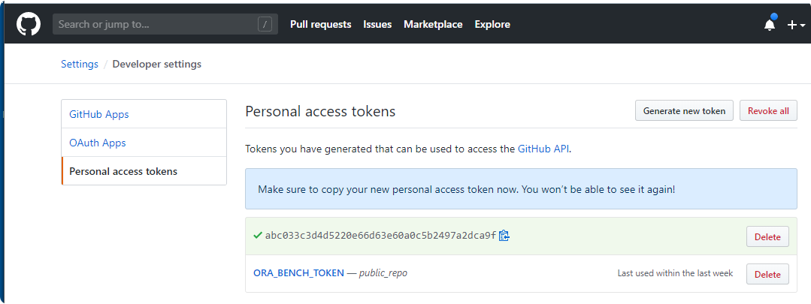

# kxn_dev - Konnexions' Development Image

This image supports the use of a Docker container for the further development of Konnexions' repositories in an Ubuntu environment. 

## 1. Creating a new Konnexions development container

## 1.1 Getting started

    > REM Assumptions:
    > REM   - you want to map the container port 8443 to the host port 443
    > REM   - the name of the Docker container should be: my_kxn_dev
    > REM   - the path the host repository is: //C/projects/my_repro
    > REM   - the directory name for this repository inside the container should be: my_repro_dir
    > REM   - you want to use the latest version of the Konnexions development image
    > docker run -it -p 443:8443 \
                 --name my_kxn_dev \
                 -v //C/projects/my_repro:/my_repro_dir \
                 konnexionsgmbh/kxn_dev:latest
            
    > REM Stopping the container
    > docker stop my_kxn_dev
    
    > REM Restarting the container
    > docker start my_kxn_dev

    > REM Entering a running container
    > docker exec -it my_kxn_dev bash

## 1.2 Detailed Syntax

A new container can be created with the `docker run` command.

##### Syntax:

    docker run -it 
               [-p <port>:8443] \
               [--name <container_name>] \
               [-v <directory_repository>:/dderl] \
               konnexionsgmbh/kxn_dev[:<version>] 
               [<cmd>]
 
##### Parameters:

- **port** - an optional listener port             
- **container_name** - an optional container identification 
- **directory_repository** - an optional host repository directory - the default value is expecting the repository inside the container 
- **version** - an optional version number of the image or the constant `latest`
- **cmd** - an optional command to be executed in the container, default is `bash` for running the `bash` shell

Detailed documentation for the command `docker run` can be found [here](https://docs.docker.com/engine/reference/run/).

##### Examples:

1. Creating a new Docker container named `my_kxn_dev` using a repository inside the Docker container:  

    `docker run -it --name my_kxn_dev konnexionsgmbh/kxn_dev:latest`

2. Creating a new Docker container named `my_kxn_dev` using the host repository of a Windows directory `D:\projects\my_repro`:  

    `docker run -it --name dderl_dev -v //D/projects/my_repro:/my_repro konnexionsgmbh/kxn_dev:latest`

3. Creating a new Docker container named `my_kxn_dev` using the host repository of a Linux directory `/my_repro` and mapping port `8443` to port `8000`:  

    `docker run -it --name my_kxn_dev -p 8000:8443 -v /my_repro:/my_repro konnexionsgmbh/kxn_dev:latest`

## 2 Working with an existing Konnexions development container

### 2.1 Starting a stopped container

A previously stopped container can be started with the `docker start` command.

##### Syntax:

    docker start <container_name>

##### Parameter:

- **container_name** - the mandatory container identification, that is an UUID long identifier, an UUID short identifier or a previously given name 

Detailed documentation for the command `docker start` can be found [here](https://docs.docker.com/engine/reference/commandline/start/).

### 2.2 Entering a running container

A running container can be entered with the `docker exec` command.

##### Syntax:

    docker exec -it <container_name> <cmd>

##### Parameter:

- **container_name** - the mandatory container identification, that is an UUID long identifier, an UUID short identifier or a previously given name 
- **cmd** - the command to be executed in the container, e.g. `bash` for running the `bash` shell

Detailed documentation for the command `docker exec` can be found [here](https://docs.docker.com/engine/reference/commandline/exec/).

## 3 Best practices

### 3.1 Use of a root repository directory on the host computer

If all relevant repositories are located within a common parent directory, then development work in all these repositories can be done within a single Konnexions development container. 

**Example:**

In the following example we assume that the host directory is named `C:\Temp\my_projects` and should be mapped to the `projects` directory in the container.

```
>C:\Temp\my_projects>docker run -it --name kxn_dev -v //C/Temp/my_projects:/projects konnexionsgmbh/kxn_dev:latest
root@35b9310932f1:/# cd projects
root@35b9310932f1:/projects# ls -ll
total 0
drwxrwxrwx 1 root root 4096 May  2 14:05 dderl
```

### 3.2 Use of private GitHub repositories inside the container

To access private repositories in GitHub, you must first create a new personal access token in GitHub and then add it to your git configuration inside the container.

#### 1. Create a new personal access token in GitHub

- With the following URL you can create the access token: https://github.com/settings/tokens


- Press the button `Generate new token`


- Name the new token, select the scopes and press the button `Generate token` 



- Write down the secret code and keep it in a safe place

#### 2. Setting up the Docker container on the host machine

In the following example we assume that the host directory is named `C:\Temp\my_projects` and should be mapped to the `projects` directory in the container.

```
C:\Temp\my_projects\dderl>docker run -it --name kxn_dev -v //C/Temp/my_projects:/projects konnexionsgmbh/kxn_dev:latest
Unable to find image 'konnexionsgmbh/kxn_dev:latest' locally
latest: Pulling from konnexionsgmbh/kxn_dev
d51af753c3d3: Pull complete
...
a6bb30d1a5cf: Pull complete
Digest: sha256:5f6d6afc566ef9142d2d85b85dd331c0558eafaaf286179fd0ae787988c1b89b
Status: Downloaded newer image for konnexionsgmbh/kxn_dev:latest
```

#### 3. Initial configuration of git in the container

```
root@332206c300f1:/# export XDG_CONFIG_HOME=/projects
root@332206c300f1:/# mkdir -p $XDG_CONFIG_HOME/git/
root@332206c300f1:/# touch $XDG_CONFIG_HOME/git/config
root@332206c300f1:/# touch $XDG_CONFIG_HOME/git/credentials
root@332206c300f1:/# git config --file=$XDG_CONFIG_HOME/git/config credential.helper 'store --file=/projects/git/credentials'
root@332206c300f1:/# git config --file=$XDG_CONFIG_HOME/git/config user.name "John Doe"
root@332206c300f1:/# git config --file=$XDG_CONFIG_HOME/git/config user.email "john.doe@company.com"
root@332206c300f1:/# git config --list --show-origin
file:/projects/git/config       credential.helper=store --file=/projects/git/credentials
file:/projects/git/config       user.name=John Doe
file:/projects/git/config       user.email=john.doe@company.com
```

#### 4. Verification of the settings

```
root@332206c300f1:/# cat /projects/git/config
[credential]
        helper = store --file=/projects/git/credentials
[user]
        name = John Doe
[user]
        email = john.doe@company.com
```

#### 5. Clone a repository for the first time

When prompted provide your github user name and the new personal access token from (1).

```
root@332206c300f1:/# cd projects
root@332206c300f1:~# git clone https://github.com/KonnexionsGmbH/docker_images
Cloning into 'docker_images'...
Username for 'https://github.com': John Doe
Password for 'https://john.doe@company.com': abc033c3d4d5220e66d63e60a0c5b2497a2dca9f
remote: Enumerating objects: 78, done.
remote: Counting objects: 100% (78/78), done.
remote: Compressing objects: 100% (49/49), done.
remote: Total 78 (delta 33), reused 68 (delta 23), pack-reused 0
Receiving objects: 100% (78/78), 167.83 KiB | 867.00 KiB/s, done.
Resolving deltas: 100% (33/33), done.
```

#### 6. Verify if the clone completed with success

```
root@332206c300f1:~# cat /projects/git/credentials
https://John Doe:abc033c3d4d5220e66d63e60a0c5b2497a2dca9f@github.com
```

#### 7. Verification after a restart of the Docker container 

```
C:\Temp\my_projects\dderl>docker start kxn_dev
kxn_dev
C:\Temp\my_projects\dderl>docker exec -it kxn_dev bash
root@332206c300f1:/# export XDG_CONFIG_HOME=/projects
root@332206c300f1:/# git config --list --show-origin
file:/projects/git/config       credential.helper=store --file=/projects/git/credentials
file:/projects/git/config       user.name=John Doe
file:/projects/git/config       user.email=john.doe@company.com
```

#### 8. Verification after the removal of the Docker container 

- Deleting the Docker container and image
 
```
C:\Temp\my_projects\dderl>docker stop kxn_dev
kxn_dev

C:\Temp\my_projects\dderl>docker rm kxn_dev
kxn_dev

C:\Temp\my_projects\dderl>docker images
REPOSITORY                  TAG                 IMAGE ID            CREATED             SIZE
konnexionsgmbh/kxn_dev      latest              51757b5e414e        6 hours ago         3.71GB

C:\Temp\my_projects\dderl>docker rmi 51757b5e414e
Untagged: konnexionsgmbh/kxn_dev:latest
Untagged: konnexionsgmbh/kxn_dev@sha256:5f6d6afc566ef9142d2d85b85dd331c0558eafaaf286179fd0ae787988c1b89b
Deleted: sha256:51757b5e414e5333ace7b163484c06e4685c29312ad09d5d7d648c6936011a60
...
Deleted: sha256:7789f1a3d4e9258fbe5469a8d657deb6aba168d86967063e9b80ac3e1154333f
```

- Recreating the Docker container (and image)

```
C:\Temp\my_projects\dderl>docker run -it --name kxn_dev -v //C/Temp/my_projects:/projects konnexionsgmbh/kxn_dev:latest
Unable to find image 'konnexionsgmbh/kxn_dev:latest' locally
latest: Pulling from konnexionsgmbh/kxn_dev
d51af753c3d3: Pull complete
...
a6bb30d1a5cf: Pull complete
Digest: sha256:5f6d6afc566ef9142d2d85b85dd331c0558eafaaf286179fd0ae787988c1b89b
Status: Downloaded newer image for konnexionsgmbh/kxn_dev:latest
root@ad1f036bbc44:/# export XDG_CONFIG_HOME=/projects
root@ad1f036bbc44:/# git clone https://github.com/KonnexionsGmbH/docker_images
Cloning into 'docker_images'...
remote: Enumerating objects: 78, done.
remote: Counting objects: 100% (78/78), done.
remote: Compressing objects: 100% (49/49), done.
remote: Total 78 (delta 33), reused 68 (delta 23), pack-reused 0
Receiving objects: 100% (78/78), 167.83 KiB | 895.00 KiB/s, done.
Resolving deltas: 100% (33/33), done.
```

- If we use the same path - where `git/config` and `git/credentials` exist - as in Step 3, `git` access (clone/push/pull) doesn't ask for username/password anymore.

## 4 Working inside a running Konnexions development container

### 4.1 `dderl` development

Inside the Docker container you can either clone a `dderl` repository or switch to an existing `dderl` repository. 
If a Docker container with an Oracle database is located on the host computer it can be accessed by using the IP address of the host computer.
Any `dderl` script can be executed inside the Docker container, for example:

    rebar3 compile
    rebar3 as prod release
    ./start.sh 
    
The following port numbers are exposed and can be mapped if necessary:

    1236
    7000-7020
    8125
    8443
    9443    

### 4.2 `ora_bench_dev` development

Inside the Docker container you can either clone a `ora_bench` repository or switch to an existing `ora_bench` repository. 

If there is a docker container with an Oracle database on the host computer, it can be accessed in two ways:

1. via the IP address of the host computer,
2. via the docker network `ora_bench_net` - the development container `kxn_dev` must be included in this network beforehand 

Any `ora_bench` script can be executed inside the Docker container, for example:

    ./scripts/run_properties_standard.sh > run_properties_standard.log 2>&1
    
**Important:** If the repository was previously used on Windows, then all files in the following directories must also be deleted from Windows first:

- `src_elixir/deps`  
- `src_elixir/mix.lock`  
- `src_erlang/_build` 

## 5 Installed core components

With the following command you can check in detail which software versions are included in the Docker image:

    apt list --installed

### Version 2.0.2

| Component             | Version            | Remark                      | Status |
|---                    |---                 |---                          |---     |
| Alien                 | 8.95               |                             |   | 
| asdf                  | v0.8.0-c6145d0     |                             |   | 
| CMake                 | 3.20.1             |                             | upgrade | 
| cURL                  | 7.76.2             |                             | upgrade | 
| Docker Compose        | 1.29.1             |                             | upgrade | 
| Docker Engine         | 20.10.6            |                             | upgrade | 
| Eclipse               | 2021-03-R          |                             | upgrade | 
| Elixir                | 1.11.4-otp-23      |                             | upgrade |
| Erlang/OTP            | 23.3.1             |                             | upgrade |
| GCC & G++             | 10.2.0             |                             |   |
| Git                   | 2.31.1             |                             | upgrade | 
| GNU Autoconf          | 2.71               |                             |   | 
| GNU Automake          | 1.16.3             |                             |   | 
| GNU make              | 4.3                |                             |   | 
| Go                    | 1.16.3             |                             | upgrade |
| Gradle                | 7.0                |                             | upgrade | 
| htop                  | 3.0.5              |                             |   | 
| Java                  | 16                 | openjdk                     | upgrade |
| Kotlin                | 1.4.32             |                             | upgrade |
| LCOV                  | 1.14               |                             |   | 
| nginx                 | 1.18.0             |                             |   |
| Node.js [npm]         | v14.16.1 [6.14.12] |                             | upgrade |
| OpenSSL               | 1.1.1k             |                             | upgrade | 
| Oracle Instant Client | 21.1.0.0.0         |                             |   | 
| Python                | 3.9.4              |                             | upgrade |
| - cx_Oracle           | 8.1                |                             |   |
| - pip                 | 21.0.1             |                             |   |
| - pyyaml              | 5.4.1              |                             |   |
| rebar3                | 3.14.3             |                             |   |
| Rust                  | 1.51.0             |                             | upgrade |
| tmux                  | 3.2                |                             | upgrade | 
| Ubuntu                | 20.04.2 LTS        | focal                       |   | 
| Vim                   | 8.2.2771           |                             | upgrade |
| wget                  | 1.21.1             |                             |   | 
| Yarn                  | 1.22.10            |                             |   | 

### Version 2.0.1

| Component             | Version            | Remark                      | Status |
|---                    |---                 |---                          |---     |
| Alien                 | 8.95               |                             |   | 
| asdf                  | v0.8.0-c6145d0     |                             |   | 
| CMake                 | 3.19.5             |                             | upgrade | 
| cURL                  | 7.75.0             |                             |   | 
| Docker Compose        | 1.28.4             |                             | upgrade | 
| Docker Engine         | 20.10.3            |                             |   | 
| Eclipse               | 2020-12-R          |                             |   | 
| Elixir                | 1.11.3-otp-23      |                             |   |
| Erlang/OTP            | 23.2.5             |                             | upgrade |
| GCC & G++             | 10.2.0             |                             |   |
| Git                   | 2.30.0             |                             |   | 
| GNU Autoconf          | 2.71               |                             |   | 
| GNU Automake          | 1.16.3             |                             |   | 
| GNU make              | 4.3                |                             |   | 
| Go                    | 1.16               |                             | upgrade |
| Gradle                | 6.8.2              |                             | upgrade | 
| htop                  | 3.0.5              |                             |   | 
| Java                  | 15.0.2             | openjdk                     |   |
| Kotlin                | 1.4.30             | release-302                 | upgrade |
| LCOV                  | 1.14               |                             |   | 
| nginx                 | 1.18.0             |                             |   |
| Node.js [npm]         | v14.15.5 [6.14.11] |                             | upgrade |
| OpenSSL               | 1.1.1j             |                             | upgrade | 
| Oracle Instant Client | 21.1.0.0.0         |                             |   | 
| Python                | 3.9.2              |                             | upgrade |
| - cx_Oracle           | 8.1                |                             |   |
| - pip                 | 21.0.1             |                             |   |
| - pyyaml              | 5.4.1              |                             |   |
| rebar3                | 3.14.3             |                             |   |
| Rust                  | 1.50.0             |                             | upgrade |
| tmux                  | 3.1c               |                             | new | 
| Ubuntu                | 20.04.2 LTS        | focal                       |   | 
| Vim                   | 8.2.2541           |                             | upgrade |
| wget                  | 1.21.1             |                             | new | 
| Yarn                  | 1.22.10            |                             | upgrade | 

### Version 2.0.0

| Component             | Version            | Remark                      | Status |
|---                    |---                 |---                          |---     |
| Alien                 | 8.95               |                             | new | 
| asdf                  | v0.8.0-c6145d0     |                             | new | 
| CMake                 | 3.19.4             |                             | new | 
| cURL                  | 7.75.0             |                             | new | 
| Docker Compose        | 1.28.2             |                             | upgrade | 
| Docker Engine         | 20.10.3            |                             |   | 
| Eclipse               | 2020-12-R          |                             |   | 
| Elixir                | 1.11.3-otp-23      |                             | upgrade |
| Erlang/OTP            | 23.2.3             | erts-11.1.7                 | upgrade |
| GCC & G++             | 10.2.0             |                             | G++ new |
| Git                   | 2.30.0             |                             | upgrade | 
| GNU Autoconf          | 2.71               |                             | new | 
| GNU Automake          | 1.16.3             |                             | new | 
| GNU make              | 4.3                |                             | new | 
| Go                    | 1.15.7             |                             |   | 
| Gradle                | 6.8.1              |                             |   | 
| htop                  | 3.0.5              |                             | new | 
| Java                  | 15.0.2             | openjdk                     |   |
| Kotlin                | 1.4.21             | release-351                 |   |
| LCOV                  | 1.14               |                             |   | 
| nginx                 | 1.18.0             |                             |   |
| Node.js [npm]         | v14.15.4 [6.14.10] |                             | npm new |
| OpenSSL               | 1.1.1i             |                             | upgrade | 
| Oracle Instant Client | 21.1.0.0.0         |                             |   | 
| Python                | 3.9.1              |                             |   |
| - cx_Oracle           | 8.1                |                             |   |
| - pip                 | 21.0.1             |                             |   |
| - pyyaml              | 5.4.1              |                             |   |
| rebar3                | 3.14.3             |                             |   |
| Rust                  | 1.49.0             |                             |   |
| Ubuntu                | 20.04.2 LTS        | focal                       | upgrade | 
| Vim                   | 8.2 1-2453         |                             | upgrade |
| Yarn                  | 1.22.5             |                             |   | 
