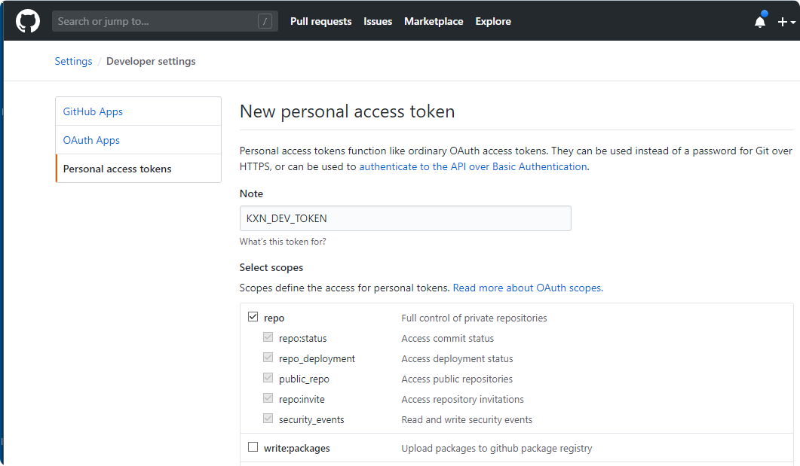

# ml_dev - Machine Learning Development Image

This image supports the use of a Docker container for the development of Machine Learning projects in an Ubuntu environment. 

### Table of Contents

**[1. Installed core components](#installed)**<br>
**[2. Creating a new Machine Learning development container](#creating)**<br>
**[3. Working with an existing Machine Learning development container](#working)**<br>
**[4. Best practices](#best)**<br>

----

## <a name="installed"></a> 1. Installed core components

With the following command you can check in detail which software versions are included in the Docker image:

    apt list --installed

### Version 1.1.2

| Component             | Version            | Remark                           | Status |
|---                    |---                 |---                               |---     |
| asdf                  | v0.8.1-95f2cdf     | base version                     |   | 
| curl                  | 7.68.0             | base version                     |   | 
| Docker Compose        | 1.29.2             |                                  |   | 
| Docker Desktop        | 20.10.8            | base version [Docker Image & VM] |   | 
| dos2unix              | 7.4.0              | base version                     |   | 
| Eclipse               | 2021-06-R          |                                  |   | 
| GCC & G++             | 10.3.0             |                                  |   |
| Git                   | 2.33.0             |                                  |   | 
| GNU Autoconf          | 2.69               | base version                     |   | 
| GNU Automake          | 1.16.1             | base version                     |   | 
| GNU Make              | 4.2.1              | base version                     |   | 
| Gradle                | 7.2                |                                  |   | 
| htop                  | 3.0.5              |                                  |   | 
| ImageMagick           | 7.1.0-4            |                                  |   |
| Java                  | 16.0.2             | openjdk                          |   |
| Julia                 | 1.6.2              |                                  |   |
| LCOV                  | 1.14               | base version                     |   |
| OpenSSL               | 1.1.1.f            | base version                     |   |
| Python                | 3.9.6              |                                  |   |
| - pip                 | 21.2.4             | base version                     |   |
| - alpha_vantage       | 2.3.1              | base version                     |   |
| - fire                | 0.4.0              | base version                     |   |
| - Keras               | 2.6.0              | base version                     |   |
| - matplotlib          | 3.4.3              | base version                     |   |
| - numpy               | 1.19.5             | base version                     |   |
| - pandas              | 1.3.1              | base version                     |   |
| - PyYAML              | 5.4.1              | base version                     |   |
| - requests            | 2.26.0             | base version                     |   |
| - scikit-learn        | 0.24.2             | base version                     |   |
| - scipy               | 1.7.1              | base version                     |   |
| - seaborn             | 0.11.1             | base version                     |   |
| - statsmodels         | 0.12.2             | base version                     |   |
| - tensorflow          | 2.6.0              | base version                     |   |
| - Theano              | 1.0.5              | base version                     |   |
| R                     | 4.1.1              |                                  |   |
| - caret               | 6.0.88             | base version                     |   |
| - knitr               | 1.33               | base version                     |   |
| - rmarkdown           | 2.10               | base version                     |   |
| - tidymodels          | 0.1.3              | base version                     |   |
|   - rsample           | 0.1.0              | base version                     |   |
|   - parsnip           | 0.1.7              | base version                     |   |
|   - recipes           | 0.1.16             | base version                     |   |
|   - workflows         | 0.2.3              | base version                     |   |
|   - tune              | 0.1.6              | base version                     |   |
|   - yardstick         | 0.0.8              | base version                     |   |
|   - broom             | 0.7.9              | base version                     |   |
|   - dials             | 0.0.9              | base version                     |   |
| - tidyverse           |                    |                                  |   |
|   - ggplot2           | 3.3.5              | base version                     |   |
|   - dplyr             | 1.0.7              | base version                     |   |
|   - tidyr             | 1.1.3              | base version                     |   |
|   - readr             | 2.0.1              | base version                     |   |
|   - purrr             | 0.3.4              | base version                     |   |
|   - tibble            | 3.1.3              | base version                     |   |
|   - stringr           | 1.4.0              | base version                     |   |
|   - forcats           | 0.5.1              | base version                     |   |
| RStudio               | 1.4.1717           | for virtual machine only         |   | 
| Ubuntu                | 20.04.3 LTS        | base version [focal]             |   | 
| Vim                   | 8.2.2269           | base version                     |   | 
| wget                  | 1.20.3             | base version                     |   | 
| Yarn                  | n/a                | asdf plugin is faulty            |   | 

----

### Version 1.1.1

| Component             | Version            | Remark                           | Status |
|---                    |---                 |---                               |---     |
| asdf                  | v0.8.1-95f2cdf     | base version                     |   | 
| curl                  | 7.68.0             | base version                     |   | 
| Docker Compose        | 1.29.2             |                                  |   | 
| Docker Desktop        | 20.10.8            | base version [Docker Image & VM] | upgrade | 
| dos2unix              | 7.4.0              | base version                     |   | 
| Eclipse               | 2021-06-R          |                                  |   | 
| GCC & G++             | 10.3.0             |                                  |   |
| Git                   | 2.33.0             |                                  | upgrade | 
| GNU Autoconf          | 2.69               | base version                     |   | 
| GNU Automake          | 1.16.1             | base version                     |   | 
| GNU Make              | 4.2.1              | base version                     |   | 
| Gradle                | 7.2                |                                  | upgrade | 
| htop                  | 3.0.5              |                                  |   | 
| ImageMagick           | 7.1.0-4            |                                  | upgrade |
| Java                  | 16.0.2             | openjdk                          | upgrade |
| Julia                 | 1.6.2              |                                  | upgrade |
| LCOV                  | 1.14               | base version                     |   |
| OpenSSL               | 1.1.1.f            | base version                     |   |
| Python                | 3.9.6              |                                  |   |
| - pip                 | 21.2.4             | base version                     | upgrade |
| - alpha_vantage       | 2.3.1              | base version                     |   |
| - fire                | 0.4.0              | base version                     |   |
| - Keras               | 2.6.0              | base version                     | upgrade |
| - matplotlib          | 3.4.3              | base version                     | upgrade |
| - numpy               | 1.19.5             | base version                     |   |
| - pandas              | 1.3.1              | base version                     | upgrade |
| - PyYAML              | 5.4.1              | base version                     |   |
| - requests            | 2.26.0             | base version                     | upgrade |
| - scikit-learn        | 0.24.2             | base version                     |   |
| - scipy               | 1.7.1              | base version                     | upgrade |
| - seaborn             | 0.11.1             | base version                     |   |
| - statsmodels         | 0.12.2             | base version                     |   |
| - tensorflow          | 2.6.0              | base version                     | upgrade |
| - Theano              | 1.0.5              | base version                     |   |
| R                     | 4.1.1              |                                  | upgrade |
| - caret               | 6.0.88             | base version                     |   |
| - knitr               | 1.33               | base version                     |   |
| - rmarkdown           | 2.10               | base version                     | upgrade |
| - tidymodels          | 0.1.3              | base version                     |   |
|   - rsample           | 0.1.0              | base version                     |   |
|   - parsnip           | 0.1.7              | base version                     | upgrade |
|   - recipes           | 0.1.16             | base version                     |   |
|   - workflows         | 0.2.3              | base version                     | upgrade |
|   - tune              | 0.1.6              | base version                     | upgrade |
|   - yardstick         | 0.0.8              | base version                     |   |
|   - broom             | 0.7.9              | base version                     | upgrade |
|   - dials             | 0.0.9              | base version                     |   |
| - tidyverse           |                    |                                  |   |
|   - ggplot2           | 3.3.5              | base version                     |   |
|   - dplyr             | 1.0.7              | base version                     |   |
|   - tidyr             | 1.1.3              | base version                     |   |
|   - readr             | 2.0.1              | base version                     | upgrade |
|   - purrr             | 0.3.4              | base version                     |   |
|   - tibble            | 3.1.3              | base version                     | upgrade |
|   - stringr           | 1.4.0              | base version                     |   |
|   - forcats           | 0.5.1              | base version                     |   |
| RStudio               | 1.4.1717           | for virtual machine only         |   | 
| Ubuntu                | 20.04.3 LTS        | base version [focal]             | upgrade | 
| Vim                   | 8.2.2269           | base version                     |   | 
| wget                  | 1.20.3             | base version                     |   | 
| Yarn                  | n/a                | asdf plugin is faulty            |   | 

----

### Version 1.1.0

| Component             | Version            | Remark                      | Status |
|---                    |---                 |---                          |---     |
| Anaconda              |                    |                             | removed |
| asdf                  | v0.8.1-a1ef92a     |                             | new | 
| curl                  | 7.77.0             |                             | new | 
| Docker Compose        | 1.29.2             |                             | upgrade | 
| Docker Engine         | 20.10.7            |                             | upgrade | 
| dos2unix              | 7.4.2              |                             | new | 
| Eclipse               | 2021-06-R          |                             | upgrade | 
| GCC & G++             | 10.3.0             |                             | new |
| Git                   | 2.32.0             |                             | upgrade | 
| Gradle                | 7.1.1              |                             | upgrade | 
| htop                  | 3.0.5              |                             | new | 
| ImageMagick           | 7.1.0-2            |                             | upgrade |
| Java                  | 16.0.1             | openjdk                     | upgrade |
| Julia                 | 1.6.1              |                             | new |
| Python                | 3.9.6              |                             | upgrade |
| - alpha_vantage       | 2.3.1              |                             | upgrade |
| - fbprophet           |                    |                             | removed |
| - fire                | 0.4.0              |                             | upgrade |
| - Keras               | 2.4.3              |                             |   |
| - matplotlib          | 3.4.2              |                             | upgrade |
| - numpy               | 1.19.5             |                             | upgrade |
| - pandas              | 1.3.0              |                             | upgrade |
| - pip                 | 21.1.3             |                             | upgrade |
| - PyYAML              | 5.4.1              |                             | upgrade |
| - requests            | 2.25.1             |                             | upgrade |
| - scikit-learn        | 0.24.2             |                             | upgrade |
| - scipy               | 1.7.0              |                             | upgrade |
| - seaborn             | 0.11.1             |                             | upgrade |
| - statsmodels         | 0.12.2             |                             | upgrade |
| - tensorflow          | 2.5.0              |                             | upgrade |
| - Theano              | 1.0.5              |                             |   |
| R                     | 4.1.0              |                             | upgrade |
| - caret               | 6.0.88             |                             | upgrade |
| - knitr               | 1.33               |                             | upgrade |
| - rmarkdown           | 2.9                |                             | upgrade |
| - tidymodels          | 0.1.3              |                             | upgrade |
|   - rsample           | 0.1.0              |                             | upgrade |
|   - parsnip           | 0.1.6              |                             | upgrade |
|   - recipes           | 0.1.16             |                             | upgrade |
|   - workflows         | 0.2.2              |                             | upgrade |
|   - tune              | 0.1.5              |                             | upgrade |
|   - yardstick         | 0.0.8              |                             | upgrade |
|   - broom             | 0.7.8              |                             | upgrade |
|   - dials             | 0.0.9              |                             |   |
| - tidyverse           |                    |                             |   |
|   - ggplot2           | 3.3.5              |                             | upgrade |
|   - dplyr             | 1.0.7              |                             | upgrade |
|   - tidyr             | 1.1.3              |                             | upgrade |
|   - readr             | 1.4.0              |                             |   |
|   - purrr             | 0.3.4              |                             |   |
|   - tibble            | 3.1.2              |                             | upgrade |
|   - stringr           | 1.4.0              |                             |   |
|   - forcats           | 0.5.1              |                             | upgrade |
| RStudio               | 1.4.1717           | for virtual machine only    | upgrade | 
| Ubuntu                | 20.04.2 LTS        | focal                       | upgrade | 
| Vim                   | 8.2.3083           |                             | upgrade | 
| wget                  | 1.21.1             |                             |   | 

----

### Version 1.0.4

| Component             | Version            | Remark                      | Status |
|---                    |---                 |---                          |---     |
| Anaconda              | 1.7.2              | 2020.07                     |   |
| Docker Compose        | 1.27.4             |                             |   | 
| Docker Engine         | 19.03.13           |                             |   | 
| Eclipse               | 2020-09            | for virtual machine only    |   | 
| Git                   | 2.29.2             |                             | upgrade | 
| Gradle                | 6.7                |                             |   | 
| ImageMagick           | 7.0.10-37          |                             | upgrade |
| Java (openjdk)        | 15                 | build 15+36-1562            |   |
| Python                | 3.8.3              |                             |   |
| - pip                 | 20.2.4             |                             |   |
| - alpha_vantage       | 2.2.0              |                             |   |
| - fbprophet           | 0.7.1              |                             | new |
| - fire                | 0.3.1              |                             | new |
| - Keras               | 2.4.3              |                             | upgrade |
| - matplotlib          | 3.3.3              |                             | new |
| - numpy               | 1.19.4             |                             | new |
| - pandas              | 1.1.4              |                             | new |
| - PyYAML              | 5.3.1              |                             | new |
| - requests            | n/a                |                             | new |
| - scikit-learn        | 0.23.2             |                             | upgrade |
| - scipy               | 1.5.4              |                             | upgrade |
| - seaborn             | 0.11.0             |                             |   |
| - statsmodels         | 0.12.1             |                             | upgrade |
| - tensorflow          | 2.3.1              |                             |   |
| - Theano              | 1.0.5              |                             | upgrade |
| R                     | 4.0.3              |                             |   |
| - caret               | 6.0.86             |                             |   |
| - knitr               | 1.30               |                             |   |
| - rmarkdown           | 2.5                |                             |   |
| - tidymodels          | 0.1.1              |                             |   |
|   - rsample           | 0.0.8              |                             |   |
|   - parsnip           | 0.1.4              |                             |   |
|   - recipes           | 0.1.15             |                             | upgrade |
|   - workflows         | 0.2.1              |                             |   |
|   - tune              | 0.1.1              |                             |   |
|   - yardstick         | 0.0.7              |                             |   |
|   - broom             | 0.7.2              |                             |   |
|   - dials             | 0.0.9              |                             |   |
| - tidyverse           |                    |                             |   |
|   - ggplot2           | 3.3.2              |                             |   |
|   - dplyr             | 1.0.2              |                             |   |
|   - tidyr             | 1.1.2              |                             |   |
|   - readr             | 1.4.0              |                             |   |
|   - purrr             | 0.3.4              |                             |   |
|   - tibble            | 3.0.4              |                             |   |
|   - stringr           | 1.4.0              |                             |   |
|   - forcats           | 0.5.0              |                             |   |
| RStudio               | 1.3.1093           | for virtual machine only    |   | 
| Ubuntu                | 20.04.1 LTS        | focal                       |   | 
| Vim                   | 8.1                |                             |   | 

----

### Version 1.0.3

| Component             | Version            | Remark                      | Status |
|---                    |---                 |---                          |---     |
| Anaconda              | 1.7.2              | 2020.07                     |   |
| Docker Compose        | 1.27.4             |                             |   | 
| Docker Engine         | 19.03.13           |                             |   | 
| Eclipse               | 2020-09            | for virtual machine only    |   | 
| Git                   | 2.29.0             |                             |   | 
| Gradle                | 6.7                |                             |   | 
| ImageMagick           | 7.0.10-34          |                             |   | 
| Java (openjdk)        | 15                 | build 15+36-1562            |   |
| Python                | 3.8.3              |                             |   |
| - alpha_vantage       | 2.2.0              |                             |   |
| - keras               | 2.4.0              |                             | new |
| - pip                 | 20.2.4             |                             |   |
| - scikit-learn        | 0.23               |                             | new |
| - scipy               | 1.5.3              |                             | new |
| - seaborn             | 0.11.0             |                             | new |
| - statsmodels         | 0.12.0             |                             | new |
| - tensorflow          | 2.3.1              |                             | new |
| - theano              | 1.0.0              |                             | new |
| R                     | 4.0.3              |                             |   |
| - caret               | 6.0.86             |                             |   |
| - knitr               | 1.30               |                             |   |
| - rmarkdown           | 2.5                |                             |   |
| - tidymodels          | 0.1.1              |                             |   |
|   - rsample           | 0.0.8              |                             |   |
|   - parsnip           | 0.1.4              |                             |   |
|   - recipes           | 0.1.14             |                             |   |
|   - workflows         | 0.2.1              |                             |   |
|   - tune              | 0.1.1              |                             |   |
|   - yardstick         | 0.0.7              |                             |   |
|   - broom             | 0.7.2              |                             |   |
|   - dials             | 0.0.9              |                             |   |
| - tidyverse           |                    |                             |   |
|   - ggplot2           | 3.3.2              |                             |   |
|   - dplyr             | 1.0.2              |                             |   |
|   - tidyr             | 1.1.2              |                             |   |
|   - readr             | 1.4.0              |                             |   |
|   - purrr             | 0.3.4              |                             |   |
|   - tibble            | 3.0.4              |                             |   |
|   - stringr           | 1.4.0              |                             |   |
|   - forcats           | 0.5.0              |                             |   |
| RStudio               | 1.3.1093           | for virtual machine only    |   | 
| Ubuntu                | 20.04.1 LTS        | focal                       |   | 
| Vim                   | 8.1                |                             |   | 

----

### Version 1.0.2

| Component             | Version            | Remark                      | Status |
|---                    |---                 |---                          |---     |
| Anaconda              | 1.7.2              | 2020.07                     |   |
| Docker Compose        | 1.27.4             |                             |   | 
| Docker Engine         | 19.03.13           |                             |   | 
| Eclipse               | 2020-09            | for virtual machine only    |   | 
| Git                   | 2.29.0             |                             |   | 
| Gradle                | 6.7                |                             |   | 
| ImageMagick           | 7.0.10-34          |                             |   | 
| Java (openjdk)        | 15                 | build 15+36-1562            |   |
| Python                | 3.8.3              |                             |   |
| - alpha_vantage       | 2.2.0              |                             | new |
| - matplotlib          | 3.3.2              |                             | new |
| - pandas              | 1.1.3              |                             | new |
| R                     | 4.0.3              |                             |   |
| - caret               | 6.0.86             |                             | new |
| - knitr               | 1.30               |                             | new |
| - rmarkdown           | 2.5                |                             | new |
| - tidymodels          | 0.1.1              |                             | new |
|   - rsample           | 0.0.8              |                             | new |
|   - parsnip           | 0.1.4              |                             | new |
|   - recipes           | 0.1.14             |                             | new |
|   - workflows         | 0.2.1              |                             | new |
|   - tune              | 0.1.1              |                             | new |
|   - yardstick         | 0.0.7              |                             | new |
|   - broom             | 0.7.2              |                             | new |
|   - dials             | 0.0.9              |                             | new |
| - tidyverse           |                    |                             | new |
|   - ggplot2           | 3.3.2              |                             | new |
|   - dplyr             | 1.0.2              |                             | new |
|   - tidyr             | 1.1.2              |                             | new |
|   - readr             | 1.4.0              |                             | new |
|   - purrr             | 0.3.4              |                             | new |
|   - tibble            | 3.0.4              |                             | new |
|   - stringr           | 1.4.0              |                             | new |
|   - forcats           | 0.5.0              |                             | new |
| RStudio               | 1.3.1093           | for virtual machine only    |   | 
| Ubuntu                | 20.04.1 LTS        | focal                       |   | 
| Vim                   | 8.1                |                             |   | 

----

### Version 1.0.1

| Component             | Version            | Remark                      | Status |
|---                    |---                 |---                          |---     |
| Anaconda              | 1.7.2              | 2020.07                     |   |
| Docker Compose        | 1.27.4             |                             | upgrade | 
| Docker Engine         | 19.03.13           |                             |   | 
| Eclipse               | 2020-09            | for virtual machine only    |   | 
| Git                   | 2.29.0             |                             | upgrade | 
| Gradle                | 6.7                |                             | upgrade | 
| ImageMagick           | 7.0.10-34          |                             | new | 
| Java (openjdk)        | 15                 | build 15+36-1562            |   |
| Python                | 3.8.3              |                             |   |
| R                     | 4.0.3              |                             |   |
| RStudio               | 1.3.1093           | for virtual machine only    |   | 
| Ubuntu                | 20.04.1 LTS        | focal                       | upgrade | 
| Vim                   | 8.1                |                             |   | 

----

### Version 1.0.0

| Component             | Version            | Remark                      | Status |
|---                    |---                 |---                          |---     |
| Anaconda              | 1.7.2              | 2020.07                     |   |
| Docker                | 19.03.13           |                             |   | 
| Docker Compose        | 1.27.1             |                             |   | 
| Eclipse               | 2020-09            | for virtual machine only    |   | 
| Git                   | 2.28.0             |                             |   | 
| Gradle                | 6.6.1              |                             |   | 
| Java (openjdk)        | 15                 | build 15+36-1562            |   |
| Python                | 3.8.3              |                             |   |
| R                     | 4.0.3              |                             |   |
| RStudio               | 1.3.1093           | for virtual machine only    |   | 
| Ubuntu                | 20.04              | focal                       |   | 
| Vim                   | 8.1                |                             |   | 

## <a name="creating"></a> 2. Creating a new Machine Learning development container

## 2.1 Getting started

    > REM Assumptions:
    > REM   - the name of the Docker container should be: my_ml_dev
    > REM   - the path the host repository is: //C/projects/my_repro
    > REM   - the directory name for this repository inside the container should be: my_repro_dir
    > REM   - you want to use the latest version of the Konnexions development image
    > docker run --name my_ml_dev \
                 -v //C/projects/my_repro:/my_repro_dir \
                 konnexionsgmbh/ml_dev:latest
            
    > REM Stopping the container
    > docker stop my_ml_dev
    
    > REM Restarting the container
    > docker start my_ml_dev

    > REM Entering a running container
    > docker exec -it my_ml_dev bash

## 2.2 Detailed syntax

A new container can be created with the `docker run` command.

##### Syntax:

    docker run -it 
               [--name <container_name>] \
               konnexionsgmbh/ml_dev[:<version>] 
               [<cmd>]
 
##### Parameters:

- **container_name** - an optional container identification 
- **directory_repository** - an optional host repository directory - the default value is expecting the repository inside the container 
- **version** - an optional version number of the image or the constant `latest`
- **cmd** - an optional command to be executed in the container, default is `bash` for running the `bash` shell

Detailed documentation for the command `docker run` can be found [here](https://docs.docker.com/engine/reference/run/).

##### Examples:

1. Creating a new Docker container named `my_ml_dev` using a repository inside the Docker container:  

    `docker run -it --name my_ml_dev konnexionsgmbh/ml_dev:latest`

2. Creating a new Docker container named `my_ml_dev` using the host repository of a Windows directory `D:\projects\my_repro`:  

    `docker run -it --name my_ml_dev -v //D/projects/my_repro:/my_repro konnexionsgmbh/ml_dev:latest`

3. Creating a new Docker container named `my_ml_dev` using the host repository of a Linux directory `/my_repro`:  

    `docker run -it --name my_ml_dev -v /my_repro:/my_repro konnexionsgmbh/ml_dev:latest`

## <a name="working"></a> 3. Working with an existing Machine Learning development container

### 3.1 Starting a stopped container

A previously stopped container can be started with the `docker start` command.

##### Syntax:

    docker start <container_name>

##### Parameter:

- **container_name** - the mandatory container identification, that is an UUID long identifier, an UUID short identifier or a previously given name 

Detailed documentation for the command `docker start` can be found [here](https://docs.docker.com/engine/reference/commandline/start/).

### 3.2 Entering a running container

A running container can be entered with the `docker exec` command.

##### Syntax:

    docker exec -it <container_name> <cmd>

##### Parameter:

- **container_name** - the mandatory container identification, that is an UUID long identifier, an UUID short identifier or a previously given name 
- **cmd** - the command to be executed in the container, e.g. `bash` for running the `bash` shell

Detailed documentation for the command `docker exec` can be found [here](https://docs.docker.com/engine/reference/commandline/exec/).

## <a name="best"></a> 4. Best practices

### 4.1 Use of a root repository directory on the host computer

If all relevant repositories are located within a common parent directory, then development work in all these repositories can be done within a single Konnexions development container. 

**Example:**

In the following example we assume that the host directory is named `C:\Temp\my_projects` and should be mapped to the `projects` directory in the container.

```
>C:\Temp\my_projects>docker run -it --name ml_dev -v //C/Temp/my_projects:/projects konnexionsgmbh/ml_dev:latest
root@35b9310932f1:/# cd projects
root@35b9310932f1:/projects# ls -ll
total 0
```

### 4.2 Use of private GitHub repositories inside the container

To access private repositories in GitHub, you must first create a new personal access token in GitHub and then add it to your git configuration inside the container.

#### 1. Create a new personal access token in GitHub

- With the following URL you can create the access token: https://github.com/settings/tokens


- Press the button `Generate new token`



- Name the new token, select the scopes and press the button `Generate token` 


- Write down the secret code and keep it in a safe place

#### 2. Setting up the Docker container on the host machine

In the following example we assume that the host directory is named `C:\Temp\my_projects` and should be mapped to the `projects` directory in the container.

```
C:\Temp\my_projects>docker run -it --name ml_dev -v //C/Temp/my_projects:/projects konnexionsgmbh/ml_dev:latest
Unable to find image 'konnexionsgmbh/ml_dev:latest' locally
latest: Pulling from konnexionsgmbh/ml_dev
d51af753c3d3: Pull complete
...
a6bb30d1a5cf: Pull complete
Digest: sha256:5f6d6afc566ef9142d2d85b85dd331c0558eafaaf286179fd0ae787988c1b89b
Status: Downloaded newer image for konnexionsgmbh/ml_dev:latest
```

#### 3. Initial configuration of git in the container

```
root@332206c300f1:/# export XDG_CONFIG_HOME=/projects
root@332206c300f1:/# mkdir -p $XDG_CONFIG_HOME/git/
root@332206c300f1:/# touch $XDG_CONFIG_HOME/git/config
root@332206c300f1:/# touch $XDG_CONFIG_HOME/git/credentials
root@332206c300f1:/# git config --file=$XDG_CONFIG_HOME/git/config credential.helper 'store --file=/projects/git/credentials'
root@332206c300f1:/# git config --file=$XDG_CONFIG_HOME/git/config user.name "John Doe"
root@332206c300f1:/# git config --file=$XDG_CONFIG_HOME/git/config user.email "john.doe@company.com"
root@332206c300f1:/# git config --list --show-origin
file:/projects/git/config       credential.helper=store --file=/projects/git/credentials
file:/projects/git/config       user.name=John Doe
file:/projects/git/config       user.email=john.doe@company.com
```

#### 4. Verification of the settings

```
root@332206c300f1:/# cat /projects/git/config
[credential]
        helper = store --file=/projects/git/credentials
[user]
        name = John Doe
[user]
        email = john.doe@company.com
```

#### 5. Clone a repository for the first time

When prompted provide your github user name and the new personal access token from (1).

```
root@332206c300f1:/# cd projects
root@332206c300f1:~# git clone https://github.com/KonnexionsGmbH/docker_images
Cloning into 'docker_images'...
Username for 'https://github.com': John Doe
Password for 'https://john.doe@company.com': abc033c3d4d5220e66d63e60a0c5b2497a2dca9f
remote: Enumerating objects: 78, done.
remote: Counting objects: 100% (78/78), done.
remote: Compressing objects: 100% (49/49), done.
remote: Total 78 (delta 33), reused 68 (delta 23), pack-reused 0
Receiving objects: 100% (78/78), 167.83 KiB | 867.00 KiB/s, done.
Resolving deltas: 100% (33/33), done.
```

#### 6. Verify if the clone completed with success

```
root@332206c300f1:~# cat /projects/git/credentials
https://John Doe:abc033c3d4d5220e66d63e60a0c5b2497a2dca9f@github.com
```

#### 7. Verification after a restart of the Docker container 

```
C:\Temp\my_projects>docker start ml_dev
ml_dev
C:\Temp\my_projects>docker exec -it ml_dev bash
root@332206c300f1:/# export XDG_CONFIG_HOME=/projects
root@332206c300f1:/# git config --list --show-origin
file:/projects/git/config       credential.helper=store --file=/projects/git/credentials
file:/projects/git/config       user.name=John Doe
file:/projects/git/config       user.email=john.doe@company.com
```

#### 8. Verification after the removal of the Docker container 

- Deleting the Docker container and image
 
```
C:\Temp\my_projects>docker stop ml_dev
ml_dev

C:\Temp\my_projects>docker rm ml_dev
ml_dev

C:\Temp\my_projects>docker images
REPOSITORY                  TAG                 IMAGE ID            CREATED             SIZE
konnexionsgmbh/ml_dev      latest              51757b5e414e        6 hours ago         3.71GB

C:\Temp\my_projects>docker rmi 51757b5e414e
Untagged: konnexionsgmbh/ml_dev:latest
Untagged: konnexionsgmbh/ml_dev@sha256:5f6d6afc566ef9142d2d85b85dd331c0558eafaaf286179fd0ae787988c1b89b
Deleted: sha256:51757b5e414e5333ace7b163484c06e4685c29312ad09d5d7d648c6936011a60
...
Deleted: sha256:7789f1a3d4e9258fbe5469a8d657deb6aba168d86967063e9b80ac3e1154333f
```

- Recreating the Docker container (and image)

```
C:\Temp\my_projects>docker run -it --name ml_dev -v //C/Temp/my_projects:/projects konnexionsgmbh/ml_dev:latest
Unable to find image 'konnexionsgmbh/ml_dev:latest' locally
latest: Pulling from konnexionsgmbh/ml_dev
d51af753c3d3: Pull complete
...
a6bb30d1a5cf: Pull complete
Digest: sha256:5f6d6afc566ef9142d2d85b85dd331c0558eafaaf286179fd0ae787988c1b89b
Status: Downloaded newer image for konnexionsgmbh/ml_dev:latest
root@ad1f036bbc44:/# export XDG_CONFIG_HOME=/projects
root@ad1f036bbc44:/# git clone https://github.com/KonnexionsGmbH/docker_images
Cloning into 'docker_images'...
remote: Enumerating objects: 78, done.
remote: Counting objects: 100% (78/78), done.
remote: Compressing objects: 100% (49/49), done.
remote: Total 78 (delta 33), reused 68 (delta 23), pack-reused 0
Receiving objects: 100% (78/78), 167.83 KiB | 895.00 KiB/s, done.
Resolving deltas: 100% (33/33), done.
```

- If we use the same path - where `git/config` and `git/credentials` exist - as in Step 4, `git` access (clone/push/pull) doesn't ask for username/password anymore.
